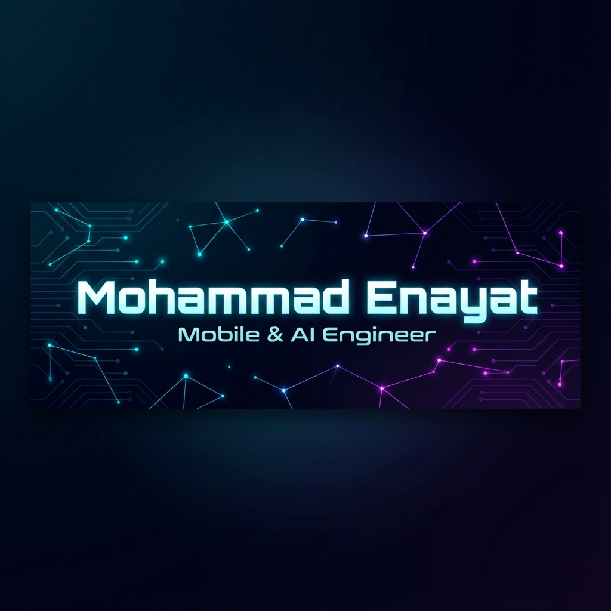

  

  

 

  
  

 

## 👨‍� About Me

I am a **Software Engineer** with **4+ years of experience** delivering production-grade mobile applications. My expertise lies in **Flutter**, **Native Android (Kotlin/Jetpack Compose)**, and **iOS**. I specialize in building performant, scalable apps with a strong focus on clean architecture and native platform integrations.

Currently, I am working at **Kasava AI**, incorporating AI models, real-time location systems, and secure payment solutions into mobile experiences.

- 🔭 **Current Focus:** Advanced Bluetooth/BLE communication & on-device AI integration.
- 💡 **Key Skills:** Clean Architecture, MVVM/BLoC, Real-time Systems (WebSockets, Maps), Payment Integrations (Stripe).
- 🌱 **Learning:** Expanding knowledge in Go (Golang) for backend scalability.

---

## �️ Tech Stack

| **Languages** | **Frameworks & UI** | **Cloud & Tools** |
|:---:|:---:|:---:|
|        |        |        |
|  |     |        |

---

## 🚀 Projects & Experience Highlights

### **Kasava AI (Dashcam App)**
*Engineered a companion app serving 5k+ users.*
- **Features:** Real-time GPS tracking (Google/HERE Maps), Biometric Security, BLE offline interaction.
- **Tech:** Flutter, Kotlin, YOLO/TFLite (AI), Stripe (Subscriptions).

### **SoftProdigy System Solutions**
*Delivered seamless apps for enterprise & fintech.*
- **Optimization:** Improved upload reliability by 90% using chunked background transfers.
- **Media:** Enabled smooth HD video playback for 10k+ users with smart caching.

---

## 📊 GitHub Stats

  
  

  

 

  

